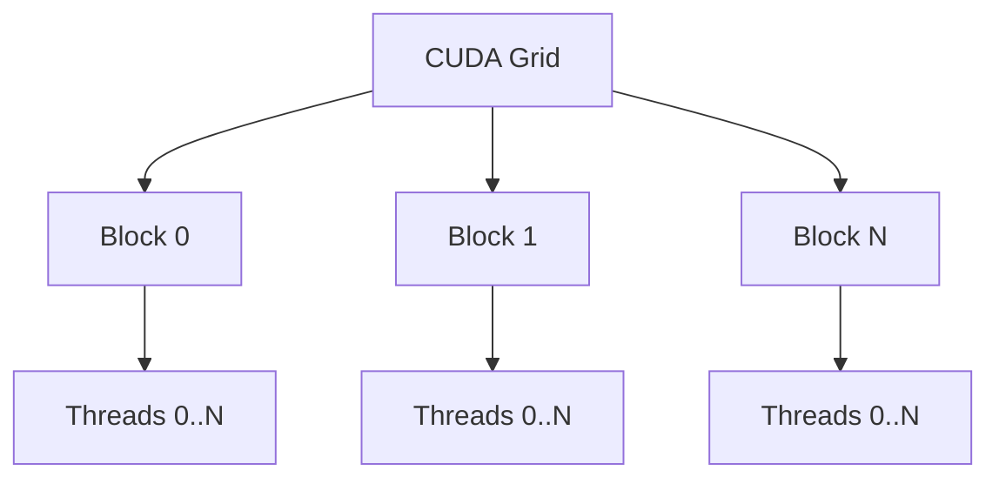
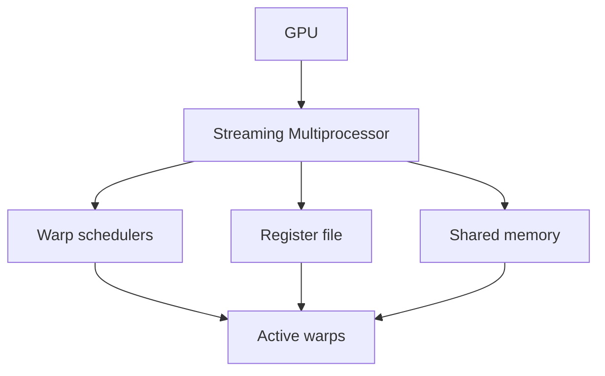

# CUDA architecture diagrams

## Grid, blocks and threads

```mermaid
flowchart TB
  G[CUDA Grid] --> B0[Block 0]
  G --> B1[Block 1]
  G --> B2[Block N]
  B0 --> T0[Threads 0..N]
  B1 --> T1[Threads 0..N]
  B2 --> T2[Threads 0..N]
```

## SM resource scheduling

```mermaid
flowchart TB
  GPU[GPU] --> SM[Streaming Multiprocessor]
  SM --> W[Warp schedulers]
  SM --> R[Register file]
  SM --> S[Shared memory]
  W --> A[Active warps]
  R --> A
  S --> A
```
